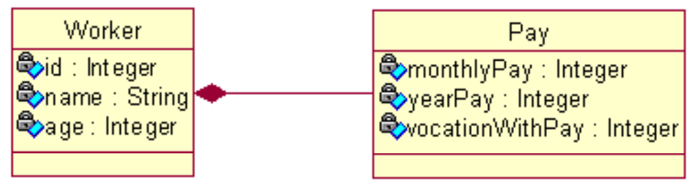
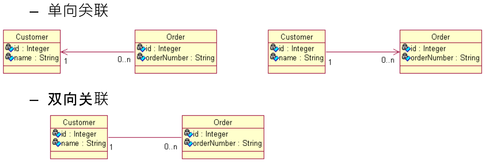
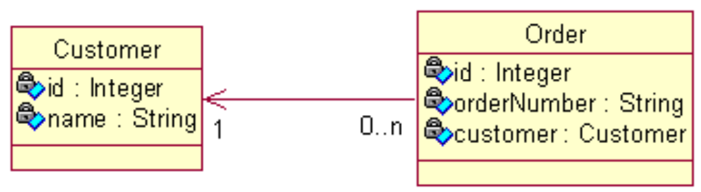
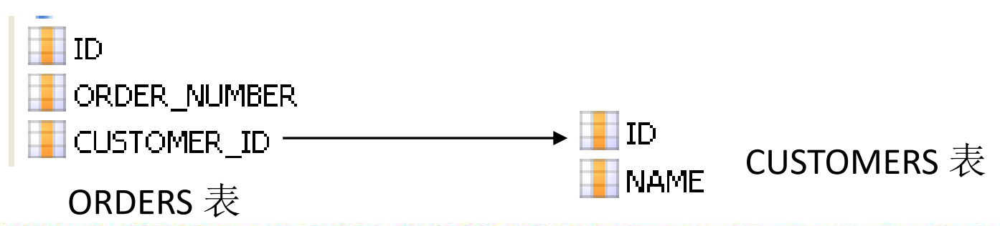
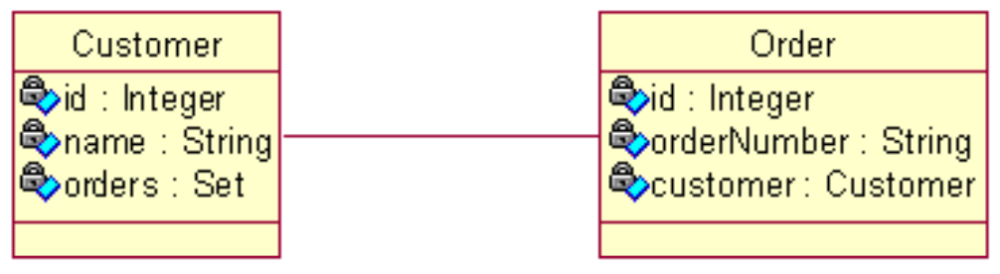

## 1. 准备Hibernate环境
1. 导入Hibernate必须的jar包：这些jar包可以在`hibernate-release-4.2.4.Final/lib/required/`目录下找到。
2. 导入数据库驱动的jar包：`mysql-connector-java-5.1.44.jar`

## 2. Hibernate开发步骤
1. 创建Hibernate配置文件: `hibernate.cfg.xml`，这个配置文件中主要包含了三部分信息
   1. 连接数据库的基本信息，比如登录数据库的用户名和密码，连接数据库的驱动，以及数据库的URL信息。
      1. Property `connection.url`中的`localhost:3306`是default value，可以省略。
   2. 配置Hibernate的基本信息，比如用的方言(Dialect)，创建表的方式等等。
      1. 关于`Dialect`的信息，可以在`hibernate-release-4.2.4.Final/project/ect/hibernate.properties`中找到。
      2. 当使用`hibernate.dialect org.hibernate.dialect.MySQLInnoDBDialect`，会出现`TYPE=InnoDB`的问题。这时候应该使用`org.hibernate.dialect.MySQLDialect`。
   3. 指定关联的hbm.xml文件，也就是对象-关系映射文件。
      1. 指定关联的hbm.xml文件时，注意是要用目录结构(`com/atguigu/hibernate/helloworld/News.hbm.xml`)，而不是包结构(`com.atguigu.hibernate.helloworld.News.hbm.xml`)。
   4. [Hibernate Configuration](https://docs.jboss.org/hibernate/orm/4.2/manual/en-US/html_single/#tutorial-firstapp-configuration)
2. 创建持久化类: `News.java`
3. 创建对象-关系映射文件: `News.hbm.xml`
   1. [The mapping file](https://docs.jboss.org/hibernate/orm/4.2/manual/en-US/html_single/#tutorial-firstapp-mapping)
4. 通过Hibernate API编写访问数据库的代码

## 3. 创建持久化Java类
1. 提供一个无参构造器: 使Hibernate可以使用`Constructor.newInstance()`来实例化持久化类。比如获取数据库中的数据: `session.get(News.class, 1)`
2. 提供一个表示同意属性(identifier property): 通常映射为数据库表的主键字段。如果没有该属性，一些功能将不起作用，如: `Session.saveOrUpdate()`
3. 为类的持久化类字段声明访问方法(get/set): Hibernate对JavaBeans风格的属性实行持久化。
4. 使用非final类: 在运行时生成代理是Hibernate的一个重要的功能。如果持久化类没有实现任何接口，Hibernate使用CGLIB生成代理。如果使用的是final类，则无法生成CGLIB代理。
5. 重写equals和hashCode方法: 如果需要把持久化类实例放到Set中，则应该重写这两个方法。

## 4. 对象-关系映射文件
* 对象：类`News`～数据库的表`NEWS`，属性`News.title`～表中的列`NEWS.TITLE`

## 5. Hibernate配置文件
`hibernate.cfg.xml`

## 6. Session的概述
* `Session`接口是Hibernate向应用程序提供的操纵数据库的最主要的接口,它提供了基本的保存,更新,删除和加载Java对象的方法(查询并不是由Session直接完成的，需要通过query)。
* `Session`具有一个缓存,位于缓存中的对象称为持久化对象,它和数据库中的相关记录对应. `Session`能够在某些时间点,按照缓存中对象的变化来执行相关的SQL语句, 来同步更新数据库, 这一过程被称为**刷新缓存(flush)**.
* 站在持久化的角度, Hibernate把对象分为4种状态: 持久化状态, 临时状态, 游离状态, 删除状态. `Session`的特定方法能使对象从一个状态转换到另一个状态.

### 6.1 Session缓存
* 在`Session`接口的实现中包含一系列的*Java集合*, 这些Java集合构成了Session缓存. 只要Session实例没有结束生命周期, 且没有清理缓存，则存放在它缓存中的对象也不会结束生命周期.
* Session缓存可减少Hibernate应用程序访问数据库的频率。

### 6.2 操作Session缓存
#### 6.2.1 flush()
* `flush()`: Session按照缓存中对象的属性变化来同步更新数据库
* 默认情况下Session在以下时间点刷新缓存：
  * 显式调用Session的`flush()`方法
  * 当应用程序调用Transaction的`commit()`方法的时, 该方法先flush，然后在向数据库提交事务
  * 当应用程序执行一些查询(HQL, Criteria)操作时， 如果缓存中持久化对象的属性已经发生了变化，会先flush缓存，以保证查询结果能够反映持久化对象的最新状态
* flush缓存的例外情况: 如果对象使用native生成器生成OID, 那么当调用Session的`save()`方法保存对象时, 会立即执行向数据库插入该实体的INSERT语句.
* `commit()`和`flush()`方法的区别： 
  * flush执行一系列SQL语句，但不提交事务； 
  * commit方法先调用flush()方法，然后提交事务. 提交事务意味着对数据库操作永久保存下来。

#### 6.2.2 refresh()
会强制发送SELECT语句，以使Session缓存中对象的状态和数据表中对应的记录保持一致
* 具体执行效果还与事务隔离级别有关 `<property name="connection.isolation">2</property>`

#### 6.2.3 clean()
* 清理缓存.

### 6.3 持久化对象的状态
站在持久化的角度，Hibernate把对象分为4种状态：
1. 临时状态(Transient)
   * 在使用代理主键的情况下，OID通常为null
   * 不处于Session的缓存中
   * 在数据库中没有对应的记录
2. 持久化状态(Persistent)
   * OID不为null
   * 位于Session缓存中
   * 若在数据库中已经有和其对应的记录，持久化对象和数据库中的相关记录对应
   * Session在flush缓存时，会根据持久化对象属性的变化，来同步更新数据库
   * 在同一个Session实例的缓存中，数据库表中的每条记录只对应唯一的持久化对象
3. 游离状态(Detached)
   * OID不为null
   * 不再处于Session缓存中
   * 一般情况下，游离对象是由持久化对象转变过来的，因此在数据库中可能还存在与它对应的记录
4. 删除状态(Removed)
   * 在数据库中没有和其OID对应的记录
   * 不再处于Session缓存中
   * 一般情况下，应用程序不该再使用被删除的对象

以上的解释来自尚硅谷佟刚的课件。以下英文解释来自Baeldung网站, [Object States in Hibernate’s Session](https://www.baeldung.com/hibernate-session-object-states)

**Object States**: In the context of Hibernates's _Session_, objects can be in one of three possible states: transient, persistent, or detached. 
* **Transient**: An object we haven't attached to any session is in the transient state. Since it was never persisted, it doesn't have any representation in the database. Because no session is aware of it, it won't be saved automatically.
* **Persistent**: An object that we've associated with a session is in the persistent state. We either saved it or read it from a persistence context, so it represents some row in the database.
* **Detached**: When we close the session, all objects inside it become detached. Although they still represent rows in the database, they're no longer managed by any session:

## 7. Session的核心方法
### 7.1 Session.save()
* Session的`save()`方法使一个临时对象转变为持久化对象
* Session的`save()`方法完成以下操作:
  * 把News对象加入到Session缓存中, 使它进入持久化状态。
  * 选用映射文件指定的标识符生成器(比如`<generator class="native"/>`), 为持久化对象分配唯一的OID。在使用代理主键的情况下,`setId()`方法为News对象设置OID使无效的。
  * 在flush缓存的时候，计划执行一条INSERT语句。
* Hibernate 通过持久化对象的OID来维持它和数据库相关记录的对应关系。**当News对象处于持久化状态时,不允许程序随意修改它的ID。**
* `persist()`和`save()`区别：
  * 当对一个OID不为Null的对象执行`save()`方法时, 会把该对象以一个新的OID保存到数据库中; 但执行`persist()`方法时会抛出一个异常。

### 7.2 Session.persist()
* 与`Session.save()`方法类似，`persist()`也会把一个临时对象转变为持久化对象，并发送INSERT语句。
* 和`save()`的区别:
  * 在调用`persist()`方法之前，若对象已经有ID了，则不会执行INSERT，而是抛出PersistentObjectException异常。

### 7.3 Session.get() & Session.load()
* 都可以根据跟定的OID从数据库中加载一个持久化对象
* 区别:
  * 当数据库中不存在与OID对应的记录时,`load()`方法抛出ObjectNotFoundException异常, 而`get()`方法返回null。
  * 两者采用不同的延迟检索策略: `load()`方法支持延迟加载策略,而`get()`不支持。
  * 若数据表中没有对应的记录，且Session没有关闭：
    * `get()`返回null
    * `load()`若不使用该对象的任何属性，没有问题；若需要初始化了，则抛出异常。
* `load()`方法可能会抛出：LazyInitializationException
  * 在需要初始化代理对象之前关闭Session，就会抛出LazyInitializationException

### 7.4 Session.update()
* Session的`update()`方法使一个游离对象转变为持久化对象,并且计划执行一条UPDATE语句.
* 若希望Session仅当修改了News对象的属性时, 才执行`update()`语句, 可以把映射文件(hbm.xml)中`<class>`元素的select-before-update设为true, 该属性的默认值为false
* 当`update()`方法关联一个游离对象时, 如果在Session的缓存中已经存在相同OID的持久化对象, 会抛出异常.
* 当`update()`方法关联一个游离对象时, 如果在数据库中不存在相应的记录, 也会抛出异常.

需要注意的是:
1. 无论需要更新的游离对象和数据表中的记录是否一致，都会发送UPDATE语句。
   * 如何能让`update()`方法不再盲目地发出UPDATE语句？在.hbm.xml文件的class节点设置`select-before-update=true` (default=false)。但通常不需要设置该属性
2. 若数据表中没有记录，但还调用了`update()`方法，会抛出异常。 see `News2Test.testUpdate5()`
3. 当`update()`方法关联一个游离对象时，如果在Session的缓存中已经有了相同的OID对象，会抛出异常。因为在Session缓存中不能有两个OID相同的对象。

### 7.5 Session.saveOrUpdate()
* Session的`saveOrUpdate()`方法同时包含了`save()`与`update()`方法的功能
  * 当对象是临时对象时，执行`save()`方法
  * 当对象是游离对象时(i.e.在Session缓存中存在)，执行`update()`方法
* 判定对象为临时对象的标准：
  * Java对象的OID为null
  * 映射文件中为`<id>`设置了`unsaved-value`属性, 并且Java对象的OID取值与这个`unsaved-value`属性值匹配

### 7.6 Session.delete()
* Session的`delete()`方法既可以删除一个游离对象, 也可以删除一个持久化对象
* 执行删除操作，只要OID和数据表中的一条记录对应，就会准备执行delete操作。若OID在数据表中没有对应记录，则抛出异常。
* Session的`delete()`方法处理过程
  * 计划执行一条DELETE语句
  * 把对象从Session缓存中删除, 该对象进入删除状态
* Hibernate的配置文件(Hibernate.cfg.xml)中有一个`hibernate.use_identifier_rollback`属性, 其默认值为false,若把它设为true, 
  将改变`delete()`方法的运行行为: `delete()`方法会把持久化对象或游离对象的OID设置为null, 使它们变为临时对象

### 7.7 Session.evict()
* 从session缓存中把指定的持久化对象移除

### 7.8 通过Hibernate调用存储过程
* `Work`接口直接通过JDBC API来访问数据库的操作
    ```java
    public interface Work {
        /**
         * Execute the discrete work encapsulated by this work instance using the supplied connection.
         *
         * @param connection The connection on which to perform the work.
         * @throws SQLException Thrown during execution of the underlying JDBC interaction.
         * @throws HibernateException Generally indicates a wrapped SQLException.
         */
        public void execute(Connection connection) throws SQLException;
    }
    ```
* Session的`doWork(Work)`方法用于执行Work对象指定的操作, 即调用Work对象的`execute()`方法. Session会把当前使用的数据库连接传递给`execute()`方法.
    ```java
    Work work = new Work() {
        @Override
        public void execute(Connection connection) throws SQLException {
            System.out.println("## connection=" + connection);  // ## connection=com.mysql.jdbc.JDBC4Connection@f9b5552，即原生的JDBC connection
            // 然后用connection 调用存储过程
            String procedure = "call test procedure";
            CallableStatement callableStatement = connection.prepareCall(procedure);
            callableStatement.executeUpdate();
        };
        
    session.doWork(work);
    ```


## 8. Hibernate配置文件(hibernate.cfg.xml)
* Hibernate配置文件主要用于**配置数据库连接**和**Hibernate运行时所需的各种属性**。
* 每个Hibernate配置文件对应一个Configuration对象
* Hibernate配置文件可以有两种格式:
  * hibernate.properties
  * hibernate.cfg.xml

### 8.1 hibernate.cfg.xml的常用属性
* JDBC 连接属性
  * `connection.url`：数据库URL
  * `connection.username`：数据库用户名
  * `connection.password`：数据库用户密码
  * `connection.driver_class`：数据库JDBC驱动
  * `dialect`：配置数据库的方言，根据底层的数据库不同产生不同的SQL语句，Hibernate会针对数据库的特性在访问时进行优化 
* C3P0 数据库连接池属性
  * `hibernate.c3p0.max_size`: 数据库连接池的最大连接数
  * `hibernate.c3p0.min_size`: 数据库连接池的最小连接数
  * `hibernate.c3p0.acquire_increment`: 当数据库连接池中的连接耗尽时, 同一时刻获取多少个数据库连接
  * `hibernate.c3p0.timeout`: 数据库连接池中连接对象在多长时间没有使用过后，就应该被销毁
  * `hibernate.c3p0.idle_test_period`: 表示连接池检测线程多长时间检测一次池内的所有链接对象是否超时. 连接池本身不会把自己从连接池中移除，
    而是专门有一个线程按照一定的时间间隔来做这件事， 这个线程通过比较连接对象最后一次被使用时间和当前时间的时间差来和`c3p0.timeout`做对比，进而决定是否销毁这个连接对象。
  * `hibernate.c3p0.max_statements`: 缓存Statement对象的数量

### 8.2 hibernate.cfg.xml其他常用属性
* `show_sql`：是否将运行期生成的SQL输出到日志以供调试, 取值 `true | false`
* `format_sql`：是否将SQL转化为格式良好的SQL, 取值`true | false`
* `hbm2ddl.auto`：在启动和停止时自动地创建，更新或删除数据库模式。 取值`create | update | create-drop | validate`
* `hibernate.jdbc.fetch_size`: 实质是调用`Statement.setFetchSize()`方法设定JDBC的Statement读取数据的时候每次从数据库中取出的记录条数。
* `hibernate.jdbc.batch_size`: 设定对数据库进行批量删除，批量更新和批量插入的时候的批次大小，类似于设置缓冲区大小的意思。

### 8.3 在Hibernate中使用C3P0数据源
1. 导入jar包
   * `hibernate-release-4.2.4.Final/lib/optional/c3p0/`路径下的所有jar包(4.2.4版本中有3个jar包)
2. 加入配置
   * `hibernate.c3p0.max_size`: 数据库连接池的最大连接数 (当前应用有高并发，且并发量特别大，应用可以使用的最多连接数就是max_size，而不是无穷地向数据库服务器索要连接)
   * `hibernate.c3p0.min_size`: 数据库连接池的最小连接数 (当前应用没有任何请求，没有任何并发，这个时候也要在连接池中保持一定量的并发。)
   * `hibernate.c3p0.acquire_increment`: 当数据库连接池中的连接耗尽时, 同一时刻获取多少个数据库连接
   * `hibernate.c3p0.timeout`: 数据库连接池中连接对象在多长时间没有使用过后， 就应该被销毁
   * `hibernate.c3p0.idle_test_period`: 表示连接池检测线程多长时间检测一次池内的所有链接对象是否超时. 连接池本身不会把自己从连接池中移除，
   而是专门有一个线程按照一定的时间间隔来做这件事，这个线程通过比较连接对象最后一次被使用时间和当前时间的时间差来和 timeout 做对比，进而决定是否销毁这个连接对象。
   * `hibernate.c3p0.max_statements`: 缓存 Statement 对象的数量

Hibernate Configuration 文档连接: `hibernate-release-4.2.4.Final/documentation/manual/en-US/html/ch03.html`


## 9. Hibernate对象关系映射文件(*.hbm.xml, hibernate mapping file)
* POJO类和关系数据库之间的***映射***可以用一个XML文档来定义。
* 通过POJO类的数据库映射文件，Hibernate可以理解持久化类(Java Class)和数据表(Table)之间的对应关系，也可以理解持久化类属性(field)与数据库表列(column)之间的对应关系。
* 在运行时，Hibernate将根据这个映射文件来生成各种SQL语句。
* 映射文件的扩展名为`.hbm.xml` (配置文件为`hibernate.cfg.xml`)。

映射文件说明
* hibernate-mapping:
  * 类层次(class): 
    * 主键: id
    * 基础类型: property
    * 实体引用类: many-to-one | one-to-one
    * 集合: set | list | map | array
      * one-to-many
      * many-to-many
    * 子类: subclass | joined-subclass
    * 其他: component | any 等
  * 查询语句(query): 用来放置查询语句，便于对数据库查询的统一管理和优化。 
* 每个Hibernate-mapping中可以同时定义多个类. 但更推荐为每个类都创建一个单独的映射文件。

### 9.1 `<hibernate-mapping>`
`<hibernate-mapping>`是Hibernate映射文件的根元素
* `schema`: 指定所映射的数据库schema的名称。若指定该属性, 则表明会为`<class>`自动添加该schema前缀。
* `catalog`: 指定所映射的数据库catalog的名称。？
* `default-cascade`(默认为 none): 设置hibernate默认的级联风格. 若配置Java属性, 集合映射时没有指定cascade属性, 则Hibernate将采用此处指定的级联风格.
* `default-access`(默认为 property): 指定Hibernate的默认的属性访问策略。 默认值为property, 即使用getter, setter方法来访问属性. 若指定access, 则Hibernate会忽略getter/setter方法, 而通过反射访问成员变量.
* `default-lazy`(默认为 true): 设置Hibernate morning的延迟加载策略. 该属性的默认值为true, 即启用延迟加载策略. 若配置Java属性映射, 集合映射时没有指定lazy属性, 则Hibernate 将采用此处指定的延迟加载策略
* `auto-import` (默认为 true): 指定是否可以在查询语言中使用非全限定的类名（仅限于本映射文件中的类）。
* `package` (可选): 指定一个包前缀，如果在映射文档中没有指定全限定的类名就使用这个作为包名.

### 9.2 `<class>`
`<class>`元素用于指定类和表的映射
* `name`: 指定该持久化类映射的持久化类的类名
* `table`: 指定该持久化类映射的表名, Hibernate默认以持久化类的类名作为表名
* `dynamic-insert`: 若设置为true, 表示当保存一个对象时, 会动态生成INSERT语句, INSERT语句中仅包含所有取值不为null的字段. 默认值为false
* `dynamic-update`: 若设置为true, 表示当更新一个对象时, 会动态生成UPDATE语句, UPDATE语句中仅包含所有取值需要更新的字段. 默认值为false
* `select-before-update`: 设置Hibernate在更新某个持久化对象之前是否需要先执行一次查询. 默认值为false (若设置为true，则总会发出SELECT语句，会降低性能，不建议设置为true)
* `batch-size`: 指定根据OID来抓取实例时每批抓取的实例数.
* `lazy`: 指定是否使用延迟加载.
* `mutable`: 若设置为true, 等价于所有的`<property>`元素的update属性为false, 表示整个实例不能被更新.默认为 true.
* `discriminator-value`: 指定区分不同子类的值. 当使用<subclass/> 元素来定义持久化类的继承关系时需要使该属性。

### 9.3 `<id>`
设定持久化类的OID和表的主键的映射。

**映射对象标识符(OID)**
* Hibernate使用对象标识符(OID)来建立内存中的对象和数据库表中记录的对应关系. 对象的OID和数据表的主键对应. Hibernate通过标识符生成器来为主键赋值
* Hibernate推荐在数据表中使用代理主键, 即不具备业务含义的字段. 代理主键通常为整数类型, 因为整数类型比字符串类型要节省更多的数据库空间.
* 在对象-关系映射文件中, `<id>`元素用来设置对象标识符. `<generator>`子元素用来设定标识符生成器
* Hibernate提供了标识符生成器接口: `IdentifierGenerator`, 并提供了各种内置实现

`<id>`的一些property
* `name`: 标识持久化类OID的属性名
* `column`: 设置标识属性所映射的数据表的列名(主键字段的名字).
* `unsaved-value`: 若设定了该属性, Hibernate会通过比较持久化类的OID值和该属性值来区分当前持久化类的对象是否为临时对象
* `type`: 指定Hibernate映射类型. Hibernate映射类型是Java类型与SQL类型的桥梁. 如果没有为某个属性显式设定映射类型, 
  Hibernate会运用反射机制先识别出持久化类的特定属性的Java类型, 然后自动使用与之对应的默认的Hibernate映射类型
* Java的基本数据类型和包装类型对应相同的Hibernate映射类型. 基本数据类型无法表达null, 所以对于持久化类的OID推荐使用包装类型

### 9.4 `<generator>`
设定持久化类设定标识符生成器
* `class`: 指定使用的标识符生成器全限定类名或其缩写名

#### increment (`<generator class="increment"/>`)
* `increament`标识符生成器由Hibernate以递增的方式为代理主键赋值。
* Hibernate会先读取数据表中的主键的最大值，而接下来向数据表中插入记录时，就在`max(id)`的基础上递增，增量为1.
* 适用范围：
  * 由于`increment`生存标识符机制不依赖于底层数据库系统, 因此它适合所有的数据库系统
  * 适用于只有单个Hibernate应用进程访问同一个数据库的场合, 在集群环境下不推荐使用它。存在并发问题，适合于测试的范围，不适合开发环境or具体的项目。
  * OID 必须为long,int或short类型, 如果把OID定义为byte类型, 在运行时会抛出异常

#### identity (`<generator class="identity"/>`)
* `identity`标识符生成器由底层数据库来负责生成标识符, 它要求底层数据库把主键定义为自动增长字段类型
* 适用范围：
  * 由于`identity`生成标识符的机制依赖于底层数据库系统, 因此, 要求底层数据库系统必须支持自动增长字段类型. 支持自动增长字段类型的数据库包括: DB2, Mysql, MSSQLServer, Sybase 等
  * OID 必须为long, int 或 short 类型, 如果把 OID 定义为 byte 类型,在运行时会抛出异常

#### sequence (`<generator class="sequence"/>`)
* `sequence`标识符生成器利用底层数据库提供的序列来生成标识符
* Hibernate 在持久化一个 News 对象时, 先从底层数据库的news_seq序列中获得一个唯一的标识号, 再把它作为主键值
* 适用范围:
  * 由于 sequence 生成标识符的机制依赖于底层数据库系统的序列, 因此, 要求底层数据库系统必须支持序列. 支持序列的数据库包括: DB2, Oracle 等
  * OID 必须为 long, int 或 short 类型, 如果把 OID 定义为 byte 类型, 在运行时会抛出异常

#### hilo (`<generator class="hilo"/>`)
* hilo 标识符生成器由 Hibernate 按照一种 high/low 算法生成标识符, 它从数据库的特定表的字段中获取 high 值.
* Hibernate 在持久化一个 News 对象时, 由 Hibernate 负责生成主键值. hilo 标识符生成器在生成标识符时, 需要读取并修改 HI_TABLE 表中的 NEXT_VALUE 值.
* 适用范围:
  * 由于 hilo 生存标识符机制不依赖于底层数据库系统, 因此它适合所有的数据库系统
  * OID 必须为 long, int 或 short 类型, 如果把 OID 定义为 byte 类型, 在运行时会抛出异常

#### native (`<generator class="native"/>`)
* `native`标识符生成器依据底层数据库对自动生成标识符的支持能力, 来选择使用 identity, sequence 或 hilo 标识符生成器
* 适用范围:
  * 由于 native 能根据底层数据库系统的类型, 自动选择合适的标识符生成器, 因此很适合于跨数据库平台开发
  * OID 必须为 long, int 或 short 类型, 如果把 OID 定义为 byte 类型, 在运行时会抛出异常

### 9.5 `property`
* `name`: 指定该持久化类的属性的名字
* `type`: 指定Hibernate映射类型. Hibernate映射类型是Java类型与SQL类型的桥梁. 如果没有为某个属性显式设定映射类型, Hibernate会运用反射机制先识别出持久化类的特定属性的Java类型, 然后自动使用与之对应的默认的Hibernate映射类型.
* `column`: 指定与类的属性映射的表的字段名. 如果没有设置该属性, Hibernate将直接使用类的属性名作为字段名.
* `not-null`: 若该属性值为true, 表明不允许为null, 默认为false
* `access`: 指定Hibernate的默认的属性访问策略。 默认值为property, 即使用getter, setter方法来访问属性. 若指定field, 则Hibernate会忽略 getter/setter方法, 而通过反射访问成员变量
* `unique`: 设置是否为该属性所映射的数据列添加唯一约束.
* `index`: 指定一个字符串的索引名称. 当系统需要Hibernate自动建表时, 用于为该属性所映射的数据列创建索引, 从而加快该数据列的查询.
* `length`: 指定该属性所映射数据列的字段的长度
* `scale`: 指定该属性所映射数据列的小数位数, 对 double, float, decimal 等类型的数据列有效.
* `formula`: 设置一个 SQL 表达式, Hibernate 将根据它来计算出派生属性的值.
* `派生属性`: 并不是持久化类的所有属性都直接和表的字段匹配, 持久化类的有些属性的值必须在运行时通过计算才能得出来, 这种属性称为派生属性

使用formulate属性时

* `formula=“(sql)”` 的英文括号不能少
* Sql 表达式中的列名和表名都应该和数据库对应, 而不是和持久化对象的属性对应
* 如果需要在 formula 属性中使用参数, 这直接使用 where cur.id=id 形式, 其中 id 就是参数, 和当前持久化对象的 id 属性对应的列的 id 值将作为参数传入.

### 9.6 Java类型，Hibernate映射类型，SQL类型之间的对应关系
Refer to [尚硅谷.佟刚.Hibernate.pdf](尚硅谷.佟刚.Hibernate.pdf)


## 10. 映射Java时间，日期类型
### 10.1 基础知识
* 在Java中, 代表时间和日期的类型包括: `java.util.Date`和`java.util.Calendar`. 
  此外,在JDBC API中还提供了3个扩展了`java.util.Date`类的子类: `java.sql.Date`, `java.sql.Time`和 `java.sql.Timestamp`, 这三个类分别和标准SQL类型中的DATE, TIME 和 TIMESTAMP类型对应
* 在标准SQL中, DATE类型表示日期, TIME类型表示时间, TIMESTAMP类型表示时间戳, 同时包含日期和时间信息.

### 10.2 如何进行映射
1. 因为`java.util.Date`是`java.sql.Date`, `java.sql.Time` and `java.sql.Timestamp`的父类，所以`java.util.Date`可以对应标准SQL中, DATE类型, TIME类型, 和TIMESTAMP类型.
2. 基于1, 所以在设置持久化类的Date类型时，设置为`java.util.Date`
3. 如何把`java.util.Date`映射为DATE，TIME和TIMESTAMP类型？
    可以通过`<property>`的`type`属性来进行映射，例如
    ```
    <property name="date" type="date">
        <column name="DATE"/>
    </property>
    <property name="date" type="time">
        <column name="DATE"/>
    </property>
    <property name="date" type="timestamp">
        <column name="DATE"/>
    </property>
    ```
   其中，`data, time, timestamp`既不是Java类型，也不是标准SQL类型，而是Hibernate映射类型。

[Hibernate 6.1: 2.1. Mapping types](https://docs.jboss.org/hibernate/orm/6.1/userguide/html_single/Hibernate_User_Guide.html#mapping-types)
`java.util.Date`是deprecated date/time types。

### 10.3 使用Hibernate内置映射类型
以下情况必须显式指定Hibernate映射类型
* 一个Java类型可能对应多个Hibernate映射类型. 例如: 如果持久化类的属性为`java.util.Date`类型, 对应的Hibernate映射类型可以是
  `date`, `time` 或 `timestamp`. 此时必须根据对应的数据表的字段的SQL类型, 来确定Hibernate映射类型. 
  如果字段为DATE类型, 那么Hibernate映射类型为date; 如果字段为TIME类型, 那么Hibernate映射类型为time; 如果字段为TIMESTATMP类型, 那么Hibernate映射类型为timestamp.


## 11. Java大对象类型的Hibernate映射
* 在Java中, `java.lang.String`可用于表示长字符串(长度超过255), 字节数组`byte[]`可用于存放图片或文件的二进制数据. 
  此外, 在JDBC API中还提供了`java.sql.Clob`和`java.sql.Blob`类型, 它们分别和标准SQL中的CLOB 和 BLOB类型对应. 
  CLOB表示字符串大对象(Character Large Object), BLOB表示二进制对象(Binary Large Object)
* MySQL不支持标准SQ 的CLOB类型, 在MySQL中, 用 TEXT, MEDIUMTEXT 及 LONGTEXT 类型来表示长度操作255的长文本数据
* 在持久化类中, 二进制大对象可以声明为`byte[]`或`java.sql.Blob`类型; 字符串可以声明为`java.lang.String`或`java.sql.Clob`
* 实际上在Java应用程序中处理长度超过255的字符串, 使用`java.lang.String`比`java.sql.Clob`更方便


## 12. 映射组成关系
建立域模型和关系数据模型有着不同的出发点：
* 域模型：由程序代码组成，通过细化持久化类的粒度可提高代码的可重用性，简化编程。
* 在没有数据冗余的情况下，应该尽可能减少表的数目，简化表之间的参照关系，以便提高数据的访问速度。

Hibernate把持久化类的属性分为两种：
1. 值(value)类型：没有OID，不能被单独持久化，生命周期依赖于所属的持久化类的对象的生命周期。比如`Pay`
2. 实体(entity)类型：有OID，可以被单独持久化，有独立的生命周期。比如`Worker`



<code style="color : red">Note</code>: **映射“组成”关系指的是值类型**，而不是实体类型。

Hibernate使用`<component>`元素来映射组成关系，该元素表名pay属性是Worker类的一个组成部分，在Hibernate中称为之为组件
```xml
<component name="pay" class="Pay">
    <parent name="worker"/>

    <property name="monthlyPay" column="MONTHLY_PAY" type="integer"/>
    <property name="vocationWithPay" column="VOCATION_WITH_PAY" type="integer"/>
    <property name="yearPay" column="YEAT_PAY" type="integer"/>
</component>
```
* `<component>`元素来映射组成关系
  * `class`: 设定组成关系属性的类型，此处表明pay的属性为`Pay`类型
* `<parent>`元素指定组件所属的整体类
  * `name`: 整体类在组件中的属性名


## 13. 映射一对多关联关系
* 在域模型中，类与类之间最普遍的关系就是**关联**关系
* 在UML中，关联是有方向的：
  * 以Customer和Order为例：一个Customer可以有多个订单，而一个订单只能属于一个Customer。从Order到Customer的关联是多对一关联；而从Customer到Order是一对多的关联。
  * 单向关联
  * 双向关联
  * 

### 13.1 单向n-1
* 单向n-1关联(即n-->1)只需要从n的一端可以访问1的一端(即从Order对象可以访问Customer对象)
* 域模型：从Order到Customer的多对一单向关联需要在Order类中定义一个Customer属性，而在Customer类中无需定义存放Order对象的属性集合。在Order中有对Customer的引用，而在Customer中不需要有对Order集合的引用。
  
* 关系数据模型：ORDERS表中的CUSTOMER_ID参照CUSTOMER表中的主键
  
    * `CUSTOMER_ID`是CUSTOMERS table的主键
    * `CUSTOMER_ID`是ORDERS table的外键
* 显然无法直接用`<property>`映射customer属性
* Hibernate使用`<many-to-one>`元素来映射多对一关联关系
  ```xml
  <many-to-one name="customer" class="Customer" column="CUSTOMER_ID" not-null="true"/>
  ```
* `<many-to-one>`元素来映射**组成关系**
  * `name`: 设定待映射的持久化类的属性名，即`Order.customer`
  * `column`: 设定和持久化类的属性对应的表的外键，即ORDERS table中的`CUSTOMER_ID`列
  * `class`: 设定待映射的持久化类的属性的类型，即`Order.customer`的类型

### 13.2 双向1-n
* 双向1-n与双向n-1是完全相同的两个情形
* 双向1-n需要从“1”端可以访问“n“端(即Order-->Customer)，反之亦然
* 域模型：从Order到Customer的多对一双向关联需要在Order类中定义一个Customer属性，而在Customer类中需定义存放Order对象的集合属性。
  
* 关系数据模型：ORDERS表中的CUSTOMER_ID参照CUSTOMER表中的主键
  
    * `CUSTOMER_ID`是CUSTOMERS table的主键
    * `CUSTOMER_ID`是ORDERS table的外键
* 当Session从数据库中加载Java集合时，创建的是**Hibernate内置的集合类**的实例，因此**在持久化类中定义集合属性时必须把属性声明为Java接口类型**。
  * Hibernate的内置集合类具有集合代理功能，**支持延迟加载策略**。
  * 事实上，Hibernate的内置集合类封装了JDK的集合类，这使得Hibernate能够对缓存中的集合对象进行脏检查，按照集合对象的状态来同步更新数据库。
* 在定义集合属性时，通常把它初始化为集合实现类的一个实例。这样可以提高程序的健壮性，避免应用程序访问取值为null的集合的方法抛出`NullPointerException`
  ```java
  private Set<Order> orders = new HashSet<>();
  
  public Set<Order> getOrders() {
    return orders;
  }

  public void setOrders(Set<Orders> orders) {
    this.orders = orders;
  }
  ```
* Hibernate使用`<set>`元素来映射Set类型的属性
  ```java
  <set name="orders"  table="ORDERS">
    <key column="CUSTOMER_ID"/>
    <one-to-many class="Order">
  </set>
  ```
  * `name`: 设定待映射的持久化类的属性的
  * `key`: 设定与所关联的持久化类对应的表的外键，即table ORDERS的CUSTOMER_ID列
  * `column`: 指定关联表的外键名
* `<one-to-many>` 设定集合属性中所关联的持久化类
  ```xml
  <many-to-one name="customer" class="Customer" column="CUSTOMER_ID"/>
  ```
  * `class`: 指定关联的持久化类的类名，即Order class


`<set>`元素的`inverse`属性
* 在Hibernate中通过设置`inverse`属性来决定由双向关联时，由哪一方来维护表和表之间的关系。`inverse=false`的为主动方，`inverse=true`的为被动方。由主动方负责维护关联关系。
* 在没有设置`inverse=true`的情况下，父子两边都会维持父子关系
* 在1-n关系中，将n方设为主动方有助于性能改善(比如，要公司老板记住每个员工的名字是不太可能的，但是让每个员工都记住老板名字就容易的多)
* 在1-n关系中，若将1端设置为主动方
  * 会额外多出UPDATE语句
  * 插入数据时无法同时插入外键列，因而无法外键列添加非空约束


## Other Notes
1. [Hibernate 4.2 Document](https://hibernate.org/orm/documentation/4.2/)
2. [javax.net.ssl.SSLHandshakeException: No appropriate protocol (protocol is disabled or cipher suites are inappropriate)](https://help.mulesoft.com/s/article/javax-net-ssl-SSLHandshakeException-No-appropriate-protocol-protocol-is-disabled-or-cipher-suites-are-inappropriate)
3. [How do I fix: "...error in your SQL syntax; check the manual for the right syntax"](https://stackoverflow.com/questions/16408334/how-do-i-fix-error-in-your-sql-syntax-check-the-manual-for-the-right-synta)
4. [HIBERNATE -- Community Documentation, 4.2](https://docs.jboss.org/hibernate/orm/4.2/manual/en-US/html_single/)
5. [Chapter 3. Configuration](https://docs.jboss.org/hibernate/orm/4.2/manual/en-US/html_single/#session-configuration)
6. [Hibernate and JPA error: duplicate import on dependent Maven project](https://stackoverflow.com/questions/25221495/hibernate-and-jpa-error-duplicate-import-on-dependent-maven-project)